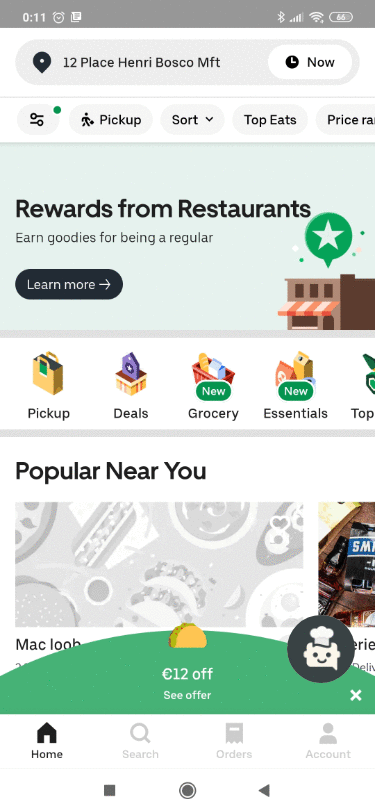

  

This is the prototype of an easy-to-use chatbot made for UberEat. It provide to the customers, a better user experience by reducing dramaticaly their anxeity during order. Its also allow them to discover new horizons and taste to new flavors.

The recommendation system coupled with the state-of-the-art chatbot model should wake up the interest for your app for new customers and increase your convertion rate.

## Dependencies

- [Adobe XD](https://www.adobe.com/fr/products/xd.html)
- [Hugging Face](https://huggingface.co/)
